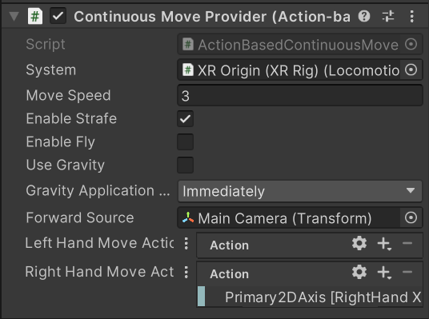

# Unity VR!

---

# 🎮 LE SYNDROME — Documentation complète

> **Une expérience VR psychologique immersive sur Meta Quest 2**
Module UPM4 · Mai 2026 · Encadrant : M. Tajini
> 

---

## 📋 Informations générales

| Champ | Détail |
| --- | --- |
| Nom du projet | Le Syndrome |
| Plateforme | Meta Quest 2 (Android ARM64) |
| Moteur | Unity 2022.3 LTS + Universal Render Pipeline (URP) |
| Framework VR | OpenXR + XR Interaction Toolkit 2.x |
| Module | UPM4 |
| Encadrant | M. Tajini |
| Équipe | Anastasia Tsundyk · Inès Robin |
| Année | Mai 2026 |

VIDEO DEMO : [https://drive.google.com/file/d/1VuckzFpk7_Xu_YPAelalTek5L4ufE3F4/view?usp=drive_link](https://drive.google.com/file/d/1VuckzFpk7_Xu_YPAelalTek5L4ufE3F4/view?usp=drive_link)

Les captures vidéo ont été réalisées via le retour écran de l'ordinateur lors de l'utilisation du casque, ce qui explique l'absence de son sur les séquences. Par ailleurs, le partage du matériel entre trois groupes a limité le temps d'accès au casque, constituant une contrainte supplémentaire pour les phases de test et d'optimisation en conditions réelles.

---

## 🧠 Présentation du projet

**Le Syndrome** est une expérience de réalité virtuelle immersive développée sous Unity, pensée pour le Meta Quest 2.

L'expérience plonge le joueur dans la psyché d'un **soldat de retour de la guerre**, souffrant de **SSPT (Syndrome de Stress Post-Traumatique)**. Le joueur est confronté à de violentes hallucinations dont il doit réussir à s'extraire. Chaque scène correspond à un état mental du personnage, naviguant entre réalité et distorsion perceptuelle. **Le but : réussir à le soigner.**

### Objectifs du projet

| Objectif | Statut |
| --- | --- |
| Transformer le jeu Unity en expérience VR | ✅ Fait |
| Compatibilité Meta Quest 2 | ✅ Fait |
| Expérience immersive et stable | ✅ Fait |
| Gameplay interactif avec contrôleurs VR | 🔄 En cours |
| Réduction du cybersickness | ✅ Fait |
| Direction artistique cohérente | ✅ Fait |
| Optimisation des performances | 🔄 En cours |

---

## 🎨 Direction artistique

La direction artistique est pensée pour être **au service de l'émotion**. L'objectif n'est pas le photoréalisme, mais la retranscription viscérale du traumatisme psychologique. L'esthétique navigue entre deux courants majeurs.

### 1. Le Surréalisme — La déformation de la réalité

*"La réalité n'est pas ce qu'elle paraît."*

Pour illustrer les hallucinations et la fracture mentale du soldat, l'environnement physique perd sa logique géométrique.

- **Shaders personnalisés** : Déformations visuelles symbolisant l'esprit fracturé. Lors des crises fortes, un shader donne l'impression que le sol se liquéfie sous les pieds du joueur.
- **Perception instable** : L'écran se brouille violemment pour simuler un malaise profond (sensation de "tomber dans les pommes") face à un trigger.
- **Dissonance visuelle** : Apparition soudaine d'éléments chaotiques au milieu d'un environnement banal (l'appartement, la rue).

### 2. L'Expressionnisme — L'émotion traduite dans l'espace

*"Les émotions prennent forme dans l'espace."*

L'angoisse et la dépression sont traduites visuellement par le travail de la lumière et du post-processing.

- **Jeux de lumière dramatiques** : Contraste brutal entre les éclairages ternes du quotidien (lumières blafardes, ombres très marquées) et l'intensité étouffante des scènes de guerre.
- **Post-process narratif** : Altération des couleurs, distorsions chromatiques, désaturation pour marquer la frontière entre le réel et le trauma.
- **Vignettage agressif** : Assombrit violemment les bords de l'écran pour simuler l'effet tunnel et l'angoisse claustrophobique d'une crise de panique.

### Palette visuelle par scène

| Scène | Ambiance ressentie | Couleurs dominantes |
| --- | --- | --- |
| Appartement | Quotidien oppressant, solitude | Gris froids, éclairages jaunes anxiogènes (ampoules nues) |
| Guerre (Flashback) | Traumatisme, chaos, urgence | Rouges intenses, oranges vifs, fumée grise |
| Cabinet Psy | Clinique, déni, dissociation | Blancs froids, verts très pâles, atmosphère stérile |
| Crise / Hallucination | Perte de repères, folie | Distorsions chromatiques, contrastes extrêmes, flou visuel |

---

## 📖 Storytelling & Univers narratif

### Synopsis

Le joueur incarne un **soldat de retour de la guerre** qui tente de reconstruire sa vie dans son appartement. Les traumatismes du passé refont surface sous forme d'hallucinations intrusives. Il faut traverser ces épreuves et aider le personnage à accepter de se soigner.

### Structure narrative

```
[SCÈNE INTRO]
Présentation de la vie du soldat — passé, guerre.

[APPARTEMENT]
Réception d'une convocation chez la psy.
→ Trigger : un son sort de la radio.

[HALLUCINATION 1]
Flashback de guerre.
→ QTE : appuyer sur un bouton au moment du texte "appuyez".

[LA VILLE]
Trajet vers le cabinet de la psychologue.
→ Trigger : un bruit de klaxon.

[HALLUCINATION 2]
Un soldat se blesse sous nos yeux.
Interaction frénétique avec la manette pour le sauver.
Le soldat meurt — échec scripté, fin de l'hallucination.

[CABINET PSY]
Le Choix. La psy demande : "Voulez-vous être aidé ?"
→ OUI : Le joueur accepte l'aide → Scène finale (Guérison).
→ NON : Le cycle traumatique recommence → Boucle narrative.
```

### Mécaniques narratives clés

- **La boucle temporelle (Le Trauma)** — Si le joueur refuse l'aide de la psychiatre (choix "NON"), le jeu redémarre. Ce n'est pas un simple Game Over : c'est une boucle narrative symbolisant l'incapacité du soldat à sortir de son traumatisme tant qu'il n'accepte pas la thérapie.
- **Les pensées flottantes** — Pour matérialiser les pensées intrusives du personnage, des textes volent et flottent physiquement dans l'espace VR autour du joueur.
- **Hallucinations et triggers** — Apparitions visuelles et auditives déclenchées par des éléments du quotidien (la radio, un klaxon).
- **QTE (Quick Time Events)** — Réagir au bon moment ou interagir rapidement avec les manettes pour tenter de s'extirper d'une vision.
- **Portes comme transitions** — Chaque porte franchie mène à un état mental différent, symbolisant la frontière poreuse entre conscience et inconscient.

---

## 🏗️ Architecture technique

### Pipeline de développement

```
[Unity Editor]
    ↓
Build Settings → Android (ARM64)
    ↓
XR Plugin Management → OpenXR → Meta Quest Feature
    ↓
XR Interaction Toolkit
    ├── XR Origin
    ├── XR Controller (Left / Right)
    └── Locomotion System
    ↓
Build & Run → APK → Meta Quest 2
```

### Structure des scènes

```
Assets/
├── Scenes/
│   ├── 0_IntroScene.unity
│   ├── 1_ApartmentScene.unity
│   ├── 2_CityScene.unity
│   ├── 3_WarScene.unity
│   └── 4_PsychiatristScene.unity
├── Scripts/
│   ├── XR/
│   │   ├── VRMovement.cs
│   │   ├── HandController.cs
│   │   └── EyeBlink.cs
│   ├── Gameplay/
│   │   ├── StressManager.cs
│   │   ├── HallucinationTrigger.cs
│   │   └── SceneTransitionManager.cs
│   └── UI/
│       └── WorldSpaceUI.cs
├── Shaders/
│   ├── HallucinationShader
│   └── DistortionEffect
└── Audio/
    ├── Spatial/
    └── Ambient/
```

---

## 🛠️ Stack & Bibliothèques

### Technologies principales

| Technologie | Version | Rôle |
| --- | --- | --- |
| Unity (URP) | 2022.3 LTS | Moteur de jeu — Universal Render Pipeline pour les perfs mobiles |
| OpenXR | 1.x | Standard de communication XR multi-plateforme natif |
| XR Interaction Toolkit | 2.x | Framework gâchettes, UI et locomotion VR |
| XR Plugin Management | 4.x | Gestion des plugins XR dans Unity |
| New Input System | 1.x | Lecture des inputs contrôleurs |
| Android Build Support | SDK/NDK | Compilation APK autonome pour le Quest 2 |

### Packages Unity (manifest.json)

```json
{
  "com.unity.xr.openxr": "1.x",
  "com.unity.xr.interaction.toolkit": "2.x",
  "com.unity.xr.management": "4.x",
  "com.unity.inputsystem": "1.x",
  "com.unity.render-pipelines.universal": "14.x"
}
```

### Outils externes

| Outil | Rôle |
| --- | --- |
| Meta Quest Developer Hub (MQDH) | Connexion casque, gestion mode développeur, déploiement APK |
| Android SDK / JDK | Compilation Android requise par Unity |
| ADB (Android Debug Bridge) | Débogage et transfert APK en ligne de commande |

### Composants XR — explication détaillée

**XR Origin**
Composant central de toute expérience VR sous Unity. Il gère le tracking de la tête (Camera Offset), les contrôleurs gauche et droit, le système de locomotion (déplacements, téléportation), et la rig caméra stéréoscopique pour le rendu VR.

**XR Controller**
Composants attachés à chaque main virtuelle. Ils lisent les inputs manettes (joystick, gâchettes, boutons), gèrent le Ray Interactor pour les interactions à distance, et le Direct Interactor pour les interactions au contact.

**Locomotion System**

- Continuous Move Provider : déplacements fluides au joystick
- Snap Turn Provider : rotation par paliers pour réduire le cybersickness
- Teleportation Provider : option téléportation disponible

---

## ⚙️ Setup & Déploiement

### Prérequis

- Unity Hub avec Unity 2022.3 LTS installé
- Module Android Build Support installé via Unity Hub
- Meta Quest Developer Hub installé
- Mode développeur activé sur le Meta Quest 2
- **Windows requis** — Meta Horizon Link est incompatible avec Mac et certaines GPU Windows. Le Build & Run est la méthode recommandée.

### Configuration Unity pas à pas

**Build Settings**

```
File → Build Settings
  Plateforme : Android
  Texture Compression : ASTC
  Run Device : Meta Quest 2 (via USB)
```

**Player Settings**

```
Edit → Project Settings → Player
  Minimum API Level : Android 10 (API 29)
  Target API Level : Automatic
  Scripting Backend : IL2CPP
  Target Architectures : ARM64 uniquement
```

**XR Plugin Management**

```
Edit → Project Settings → XR Plugin Management
  Onglet Android → OpenXR ✓
  OpenXR Settings → Meta Quest Support ✓
  Interaction Profiles : Oculus Touch Controller Profile ✓
```

**Quality Settings**

```
Edit → Project Settings → Quality
  Désactiver tous les niveaux non-Android
  Anti-aliasing : 4x
  Shadow Distance : réduit selon la scène
```

**Installation des packages**

```
Window → Package Manager
  XR Interaction Toolkit → Install
  Import Sample : "Starter Assets"
  Import Sample : "XR Device Simulator" (pour tests éditeur)
```

### Déploiement sur Meta Quest 2

**Étape 1 — Activer le mode développeur**

1. Créer un compte développeur Meta
2. Sur le casque : Paramètres → Système → Développeur → Mode développeur ✓
3. Connecter le casque au PC via USB-C
4. Accepter la demande d'autorisation ADB dans le casque

**Étape 2 — Vérifier via MQDH**

1. Ouvrir Meta Quest Developer Hub
2. Vérifier que le casque apparaît comme "Connected"
3. Vérifier que le mode développeur est actif

**Étape 3 — Build & Run**

```
File → Build Settings
  Sélectionner le device Meta Quest 2
  Cliquer "Build And Run"
```

Le jeu est compilé en APK, transféré via ADB, puis lancé directement dans le casque. Une fois installé, il est accessible dans **Bibliothèque → Applications inconnues**, sans connexion au PC.

| Type de build | Durée estimée |
| --- | --- |
| Premier build (cold) | ~20 minutes |
| Build Android optimisé | ~15 minutes |

---

## 🎮 Gameplay & Contrôles

### Schéma des contrôles

| Contrôle | Manette gauche | Manette droite |
| --- | --- | --- |
| Joystick | Déplacement | Déplacement |
| Gâchette (index) | Interactions / QTE | Interactions / QTE |
| Rotation caméra | — | Tête uniquement (physique) |

> La rotation de la caméra se fait **uniquement via la tête** (physiquement). Aucune rotation artificielle à la manette. Le joueur doit tourner son propre corps, ce qui renforce l'embodiment.
> 

### Mécaniques de jeu détaillées

**Déplacement**
Le joueur pousse le joystick pour avancer. La vitesse est réduite dans la War Scene et l'Exterior Scene pour accentuer la lourdeur psychologique.



**Interactions**
Le jeu favorise des interactions épurées pour réduire la friction. Le joueur n'utilise que la gâchette arrière (index) pour répondre à la psy (et une fois le bouton A pour continuer le dialogue de la psy), exécuter les QTE, ou utiliser le pointeur laser (Ray Controller) sur les interfaces World Space. 


**Hallucinations et triggers**
Les hallucinations sont déclenchées par des sons spatialisés (radio, klaxon) ou des zones de proximité scriptées. Elles forcent le joueur à subir des flashbacks sans possibilité de fuite.

Hallucination 1 (simulateur) : [https://drive.google.com/file/d/1e7xzd8p0_RhsC2ZNpwExc-NIfCG8YGhi/view?usp=sharing](https://drive.google.com/file/d/1e7xzd8p0_RhsC2ZNpwExc-NIfCG8YGhi/view?usp=sharing)

Hallucination 2 (simulateur) : [https://drive.google.com/file/d/1oU6UJpqIY-MmQMO220h_1KmAfF0agXLa/view?usp=sharing](https://drive.google.com/file/d/1oU6UJpqIY-MmQMO220h_1KmAfF0agXLa/view?usp=sharing)

**Pensées flottantes**
Les pensées intrusives du personnage sont matérialisées sous forme de textes qui volent physiquement dans l'espace VR autour du joueur.

**Navigation entre scènes**
Les portes déclenchent des transitions avec fondu (Fade to Black). Des colliders sur les murs et les portes empêchent le joueur de traverser la géométrie.

---

## 🧬 Théorie XR — Modèle i² (Immersion & Interaction)

Le projet a été pensé autour des piliers fondamentaux de la réalité virtuelle, en s'appuyant sur la théorie de la double "i".

### Présence (Presence)

La présence est le sentiment subjectif d'être réellement dans l'environnement virtuel — de "y être" plutôt que de le regarder depuis l'extérieur.

Dans Le Syndrome, l'objectif est de créer un sentiment d'**angoisse oppressante et de perte de repères**. La présence est renforcée par :

- **Vision 360° et Head Tracking 6DOF** : via OpenXR natif. Le joueur ne peut pas échapper aux visions en détournant le regard.
- **Audio spatial 3D** : Les triggers (klaxon, radio) sont spatialisés et surprennent le joueur, l'obligeant à regarder dans une direction précise, ce qui accélère la montée de stress.
- **Esthétique anxiogène** : Lumières déformées, couleurs altérées, ombres dramatiques et vignettage qui réduit le champ de vision comme lors d'une véritable crise de panique.

### Embodiment

L'embodiment est l'appropriation du corps virtuel par l'utilisateur — le sentiment que les mains et le corps à l'écran sont les siens.

- **Rotation 100% physique** : L'absence de rotation à la manette oblige le joueur à bouger son propre corps, fusionnant ses mouvements réels et virtuels.
- **Interactions épurées** : L'utilisation de la gâchette unique concentre l'urgence. Essayer de sauver le soldat de manière frénétique crée une sensation de fatalité et d'impuissance d'autant plus violente que l'échec est inévitable et scripté.
- **Mouvements 6DOF** via XR Origin pour un alignement parfait entre corps réel et vue virtuelle.

### Impact sur l'expérience narrative

Plus la présence est forte, plus les hallucinations sont perturbantes et crédibles. Plus l'embodiment est fort, plus le joueur ressent les émotions du personnage comme les siennes. Ensemble, ils transforment une narration externe en expérience vécue de l'intérieur.

---

## 🤢 Cybersickness & Confort utilisateur

### Définition

Le cybersickness est un mal des transports provoqué par un conflit entre ce que les yeux perçoivent (mouvement dans l'environnement virtuel) et ce que le corps ressent (immobilité physique).

### Causes et solutions appliquées

| Cause | Problème | Solution |
| --- | --- | --- |
| FPS instables | Mouvement saccadé → nausées | Optimisation GPU, batching, réduction post-process |
| Latence de tracking | Décalage tête/image → désorientation | OpenXR natif, Late Latching activé |
| Rotation artificielle | Désorientation instantanée | Rotation physique uniquement (tête) |
| Accélérations rapides | Inertie perçue | Vitesse constante, pas d'accélération/décélération |
| FOV non adapté | Bords de vision instables | Vignette aux bords lors des déplacements |
| Géométrie traversable | Désorientation spatiale | Box Colliders sur murs, portes et objets |

### Recommandations pour les joueurs

- Commencer par des sessions courtes (15–20 min maximum)
- S'assurer que l'IPD (distance inter-pupillaire) est bien réglé sur le casque
- En cas d'inconfort lors des déplacements fluides, utiliser la téléportation

---

## ⚡ Optimisations

### Contraintes du Meta Quest 2

Le Quest 2 est un appareil mobile autonome avec des ressources limitées :

- CPU : Snapdragon XR2 (équivalent mobile)
- GPU : Adreno 650
- RAM : 6 Go
- Contrainte majeure : rendu stéréoscopique = 2 images par frame (une par œil)

Conformément aux recommandations techniques de Meta pour le développement sur Quest 2, la cible de performance est fixée à 72 FPS (soit 13.8 ms par frame), correspondant à la fréquence de rafraîchissement native du matériel pour garantir le confort visuel et éviter la sensation de nausée.

[https://developers.meta.com/horizon/documentation/unity/unity-set-disp-freq/](https://developers.meta.com/horizon/documentation/unity/unity-set-disp-freq/)

### Bilan des Performances : Avant / Après

Avant l'intervention, les scènes saturaient le processeur graphique avec un rendu instable proche de **15 FPS** (soit plus de 66 ms par image), ce qui rendait l'expérience inutilisable en raison de la latence.

**Grâce aux optimisations, nous avons stabilisé le Frame Time entre 16 ms et 30 ms selon les scènes.**


### Optimisations CPU (scripts & physique)

- **Suppression des Update() inutiles** : Réduction drastique des calculs exécutés 72 fois par seconde. Remplacement par des Coroutines et Events uniquement quand nécessaire.
- **Mise en cache stricte** : Les appels coûteux comme `GetComponent` ou `FindObjectOfType` sont interdits dans les boucles de jeu et mis en cache dans `Start()`.
- **Suppression des MeshColliders** : Trop complexes pour le processeur mobile. Remplacés par des formes primitives (Box Colliders, Sphere Colliders).

### Optimisations GPU (rendu & éclairage)

- **Baked Lighting** : L'éclairage est précalculé. Aucune lumière dynamique calculée en temps réel.
- **Single Pass Instanced** : Utilisation du mode de rendu XR le plus performant pour traiter les deux yeux en un seul passage de calcul.
- **Static Batching & Culling** : Regroupement des objets statiques pour réduire les Draw Calls. Les objets non visibles ne sont pas rendus.
- **Post-processing intelligent** : Désactivé par défaut. Activé uniquement pendant les hallucinations (narrativement justifié), pour économiser la batterie et éviter la surchauffe.
- **Compression ASTC** : Format natif et ultra-optimisé pour les puces Snapdragon du Quest 2.

### Cibles de performance

| Métrique | Cible | Seuil critique |
| --- | --- | --- |
| FPS | 72 fps stable | < 60 fps = cybersickness immédiat |
| Draw Calls | < 100 / frame | > 200 = lag visible |
| Triangle Count | < 500k / frame | > 1M = lag sévère |
| Chauffe (Thermals) | Modérée | Throttle CPU/GPU du Quest |

**Note sur l'évolution future** : Pour réduire encore plus l’optimisation, les prochaines optimisations se concentreront sur une gestion encore plus fine du CPU, notamment en limitant les calculs physiques en temps réel et en optimisant les scripts restants via le système d'Events pour vider totalement la charge des fonctions "Update".

---

## 🐛 Bugs & Solutions

### Bugs résolus ✅

| Bug | Cause | Solution |
| --- | --- | --- |
| Œil gauche tout blanc au démarrage | Mauvaise configuration OpenXR | Correction des réglages OpenXR, reconfiguration XR Camera |
| Mauvaise caméra active (vue plate au lieu de VR) | Conflit avec la Main Camera classique Unity | Suppression de la caméra classique, XR Origin en exclusif |
| Interactions VR instables | Colliders ou Ray Interactors mal ajustés | Reconfiguration XR Ray Interactors, nettoyage des colliders |
| Problème de chargement de scènes | Destruction du joueur ou mauvais index | Gestion asynchrone des scènes + correction index Build Settings |
| Temps de build très longs (20 min+) | Android mal configuré, recompilation totale | Optimisation Build Settings, cache Gradle, ARM64 strict |

### Bugs en cours 🔄

| Bug | Scène | Priorité |
| --- | --- | --- |
| Bouton Trigger bloqué | Sample Scene | 🔴 Haute |
| Caméra mal placée après guerre | War Scene | 🔴 Haute |
| Colliders insuffisants (traversée d'objets) | Toutes | 🔴 Haute |
| Vidéo intro pas centrée | Intro Scene | 🟡 Moyenne |

### Limitations connues

- **Incompatibilité Mac** : Meta Horizon Link ne fonctionne pas sur Mac. Seul le Build & Run via MQDH est fonctionnel.
- **Incompatibilité certaines GPU Windows** : Même limitation. Solution : Build & Run.

---

## 🗺️ Roadmap & TODO

### Sprint actuel

- [ ]  Toutes les interactions manettes (joystick fonctionnel)
- [ ]  Écrits narratifs placés dans toutes les scènes
- [ ]  Caméra bien positionnée après War Scene
- [ ]  Soldat blessé qui détecte le joueur (trigger de proximité)
- [ ]  Ajout des mains du personnage (Hand Controller models)
- [ ]  Changement de scène via porte (pas seulement gâchette)
- [ ]  Scène intro : vidéo centrée + caméra face au texte
- [ ]  Fondus entre scènes (Fade to Black)
- [ ]  Colliders portes et murs (empêcher la traversée)
- [ ]  Ajout d'un toit sur les scènes extérieures
- [ ]  Points de spawn agrandis
- [ ]  Vitesse réduite dans War Scene et Exterior Scene
- [ ]  Box Colliders allongés pour mieux gérer les collisions
- [ ]  Perso qui tombe lors de Hallucination 2
- [ ]  "Pensées à part" intégrées et flottantes
- [ ]  Interactions boutons dans les 3 scènes (Appartement, Guerre, Psy)

### Prochaines itérations

- [ ]  Hand Tracking natif Meta (sans contrôleurs)
- [ ]  Hallucinations avancées
- [ ]  Optimisation finale du build (cible < 10 min)
- [ ]  Gameplay complet avec fin narrative
- [ ]  Tests utilisateurs et ajustements cybersickness
- [ ]  Transformation en APK standalone final
- [ ]  Audio spatial complet avec occlusion audio
- [ ]  Effets haptiques sur les contrôleurs
- [ ]  Compatibilité Meta Quest 3

---

## 👥 Équipe

| Membre | Rôle |
| --- | --- |
| Inès Robin | Développement Unity / XR & Optimisation |
| Anastasia Tsundyk | Direction artistique & Narrative Design |

---

*"Le Syndrome : Affronter ses propres démons."***LE SYNDROME VR — UPM4 · Meta Quest 2 · Mai 2026**

---

[Oral](https://www.notion.so/Oral-358b2de42dd480808191c345d2bb36f3?pvs=21)
